# Tugether😊

<br></br>

## 1. 로그인

가입한 적이 있다면, 가입된 이메일과 비밀번호로 접속한다.

- 임시 비밀번호로 로그인할 경우
  1. 로그인페이지에서 전달받은 사용자정보에 저장된 값을 확인한다.
  2. 비밀번호 변경 페이지로 이동하여 비밀번호 변경 요청한다.
  3. 비밀번호 변경 후 로그인 토큰을 삭제한다.
  4. 로그인 페이지에서 변경된 비밀번호로 재로그인한다.

- 임시 비밀번호가 아닌 경우 
  1. 로그인페이지에서 전달받은 사용자정보에 저장된 값을 확인한다.
  2. 관심태그 정보가 저장되어 있으면, 메인피드로 바로 이동한다.
  3. 관심태그 정보가 저장되어 있지 않으면, 관심태그 설정 페이지로 이동한다.

#### 임시 비밀번호로 로그인 시

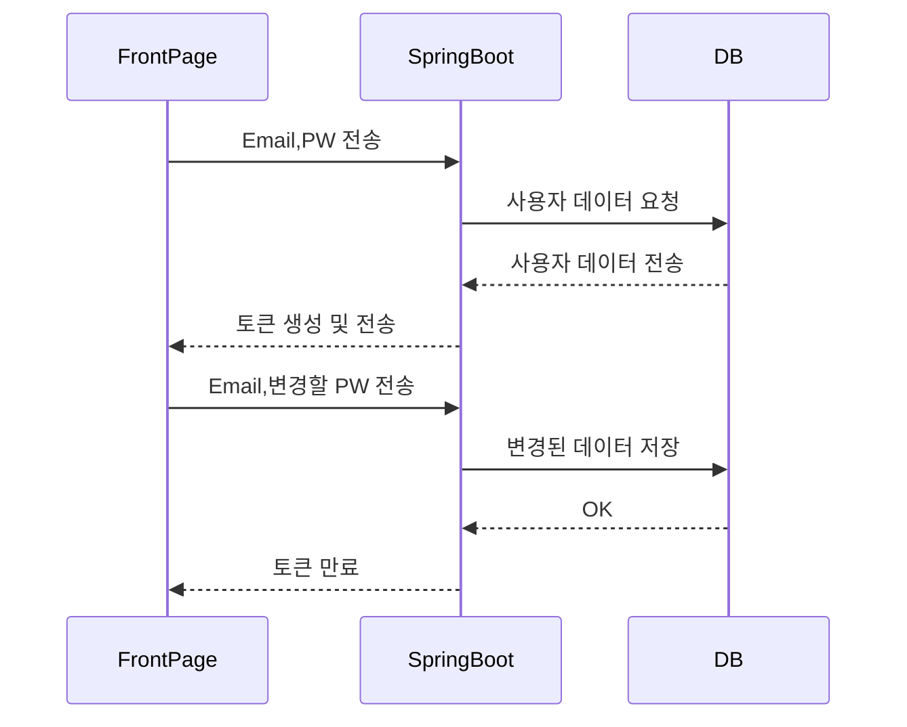

#### 개인 비밀번호로 로그인 시

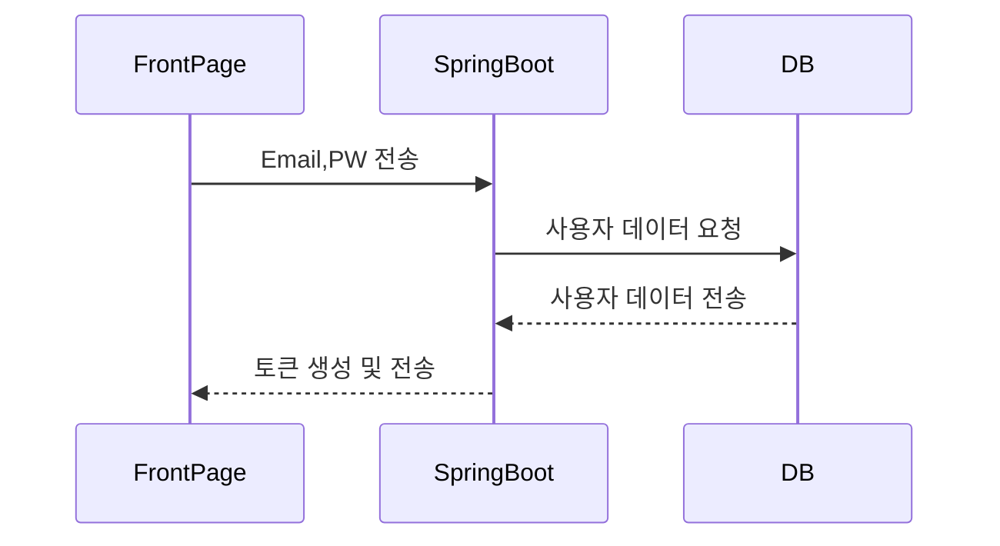

<br></br>

## 2. 회원가입

가입한 적이 없다면 회원가입을 진행한다.

회원가입 시 Email을 입력받고, 해당 메일주소로 인증번호를 발송해 유효성을 체크한 후 필요한 정보를 입력하여 회원가입을 수행한다.

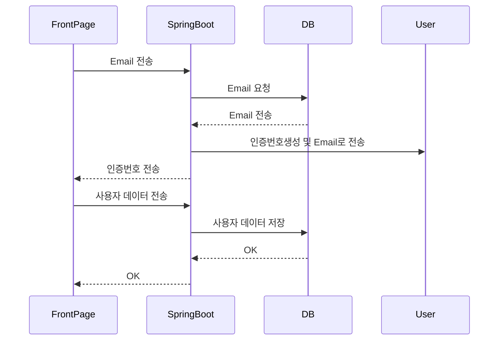

<br></br>

## 3. 비밀번호 찾기

비밀번호를 잊었다면, 

1. Email을 입력하여 DB에 저장되어 있는지 확인한다.
2. DB에 존재한다면 해당 메일로 임시비밀번호를 발급받는다.

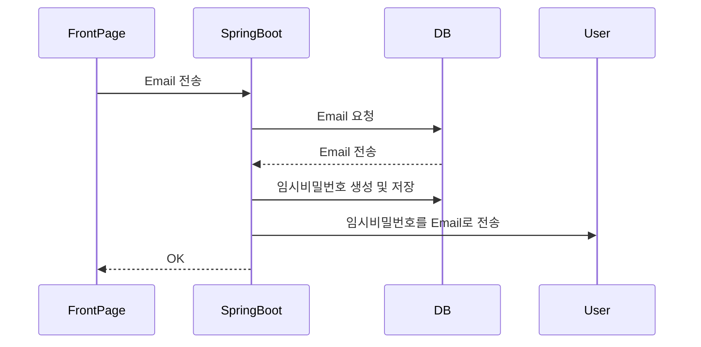

<br></br>

## 4. 관심태그 등록

최초 로그인 시 메인피드에서 글을 추천받을 수 있도록 관심태그를 최소 1개 최대 3개까지 등록한다.

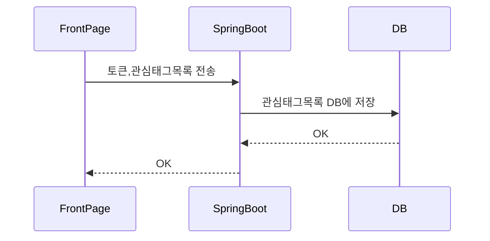

<br></br>

## 5. 메인피드 보기

로그인 후 메인피드에서 등록된 관심태그를 기반으로 해당 태그가 등록된 게시글들을 띄운다.

또한, 팔로우한 사용자들이 올린 게시글들을 볼 수 있다.

#### 관심태그가 등록된 글 보기

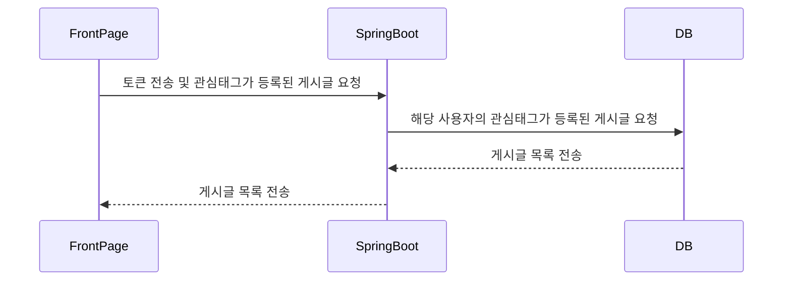

#### 팔로우 글 보기

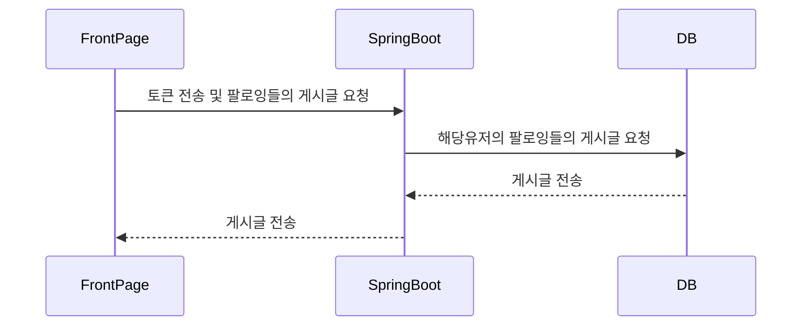

<br></br>

## 6. 좋아요

게시글 아래 토글버튼을 사용하여 좋아요 기록을 확인하여 좋아요 또는 좋아요 취소를 수행한다.

기능을 수행할 때마다 변하는 좋아요 개수를 전달받아 화면에 띄운다.

#### 좋아요 시

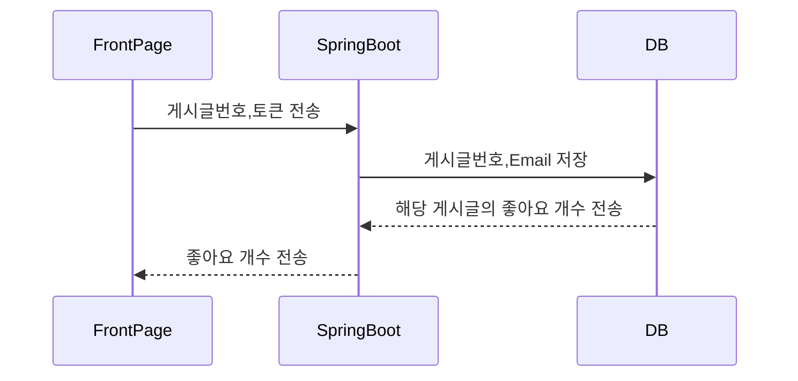

#### 좋아요 취소 시


<br></br>

## 7. 스크랩

스크랩 클릭 시 마이페이지에 스크랩한 게시글로 등록할 수 있도록 하고 마이페이지에서는 스크랩한 게시글을 삭제할 수 있다.

- 해당 게시물을 스크랩한 기록이 없을 경우 confirm창으로 한 번 더 스크랩 할지의 여부를 물어본다.
- 스크랩한 기록이 있다면, alert창으로 이미 스크랩한 게시물이라는 안내 문구를 띄운다.

#### 스크랩 기록이 있는 경우

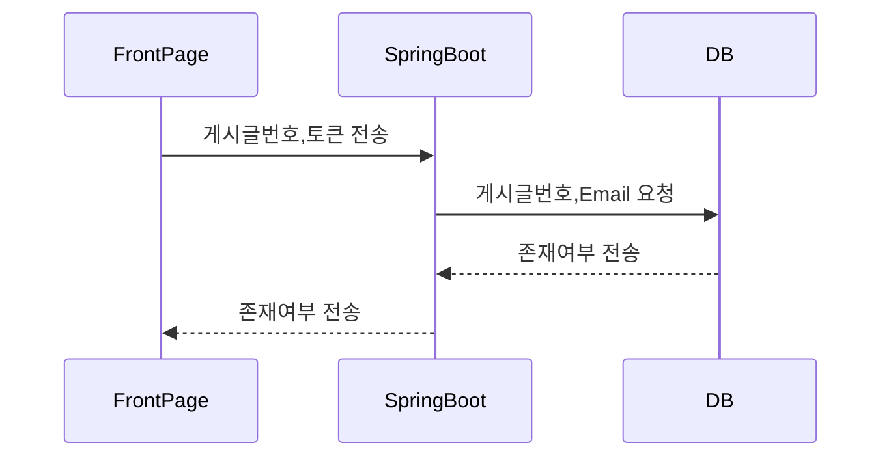

#### 스크랩 기록이 없는 경우

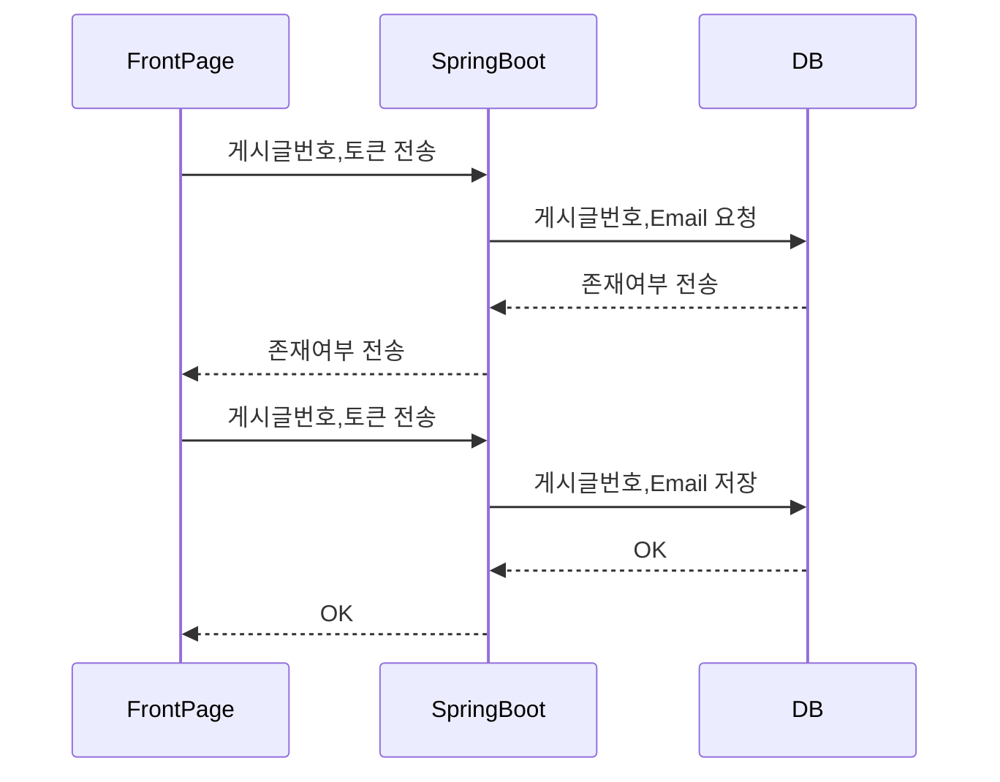

<br></br>

## 8. 게시글 작성

사진, 본문, 관심태그를 필수로 입력받고, 선택사항으로 링크 입력을 하면 마이페이지의 내 게시글에 업로드한다.

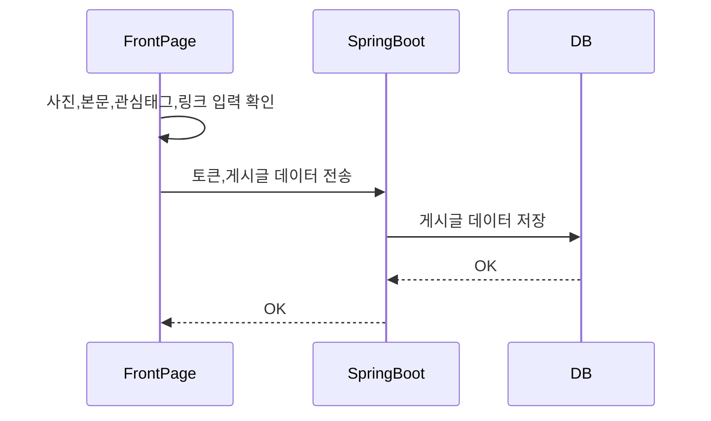

<br></br>

## 9. 댓글 작성

게시글에 댓글이나 답글을 등록한다.

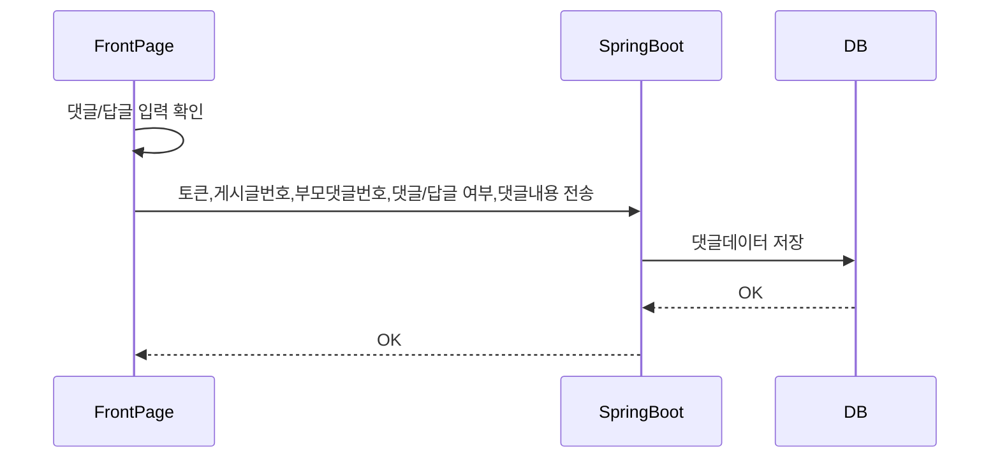

<br></br>

## 10. 팔로우 기능

다른 사용자의 마이페이지에서 팔로우 버튼을 클릭하여 팔로우한다.
마이페이지에서 팔로잉/팔로워 문구를 클릭하면 팔로잉/팔로워 리스트를 제공받는다.
팔로잉/팔로워 리스트에 팔로우하고 있지 않은 회원정보 옆에는 팔로우 버튼이 활성화 되고,  이미 팔로우 하고있는 경우는 팔로잉 버튼이 활성화 된다.

#### 팔로우 하기

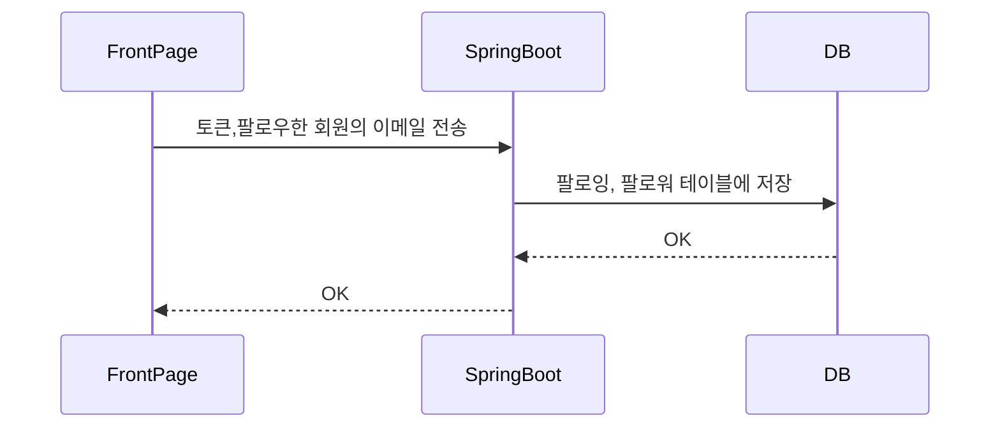

#### 팔로우 끊기

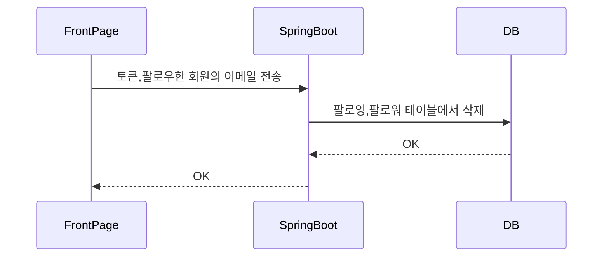

#### 팔로우 리스트 보기

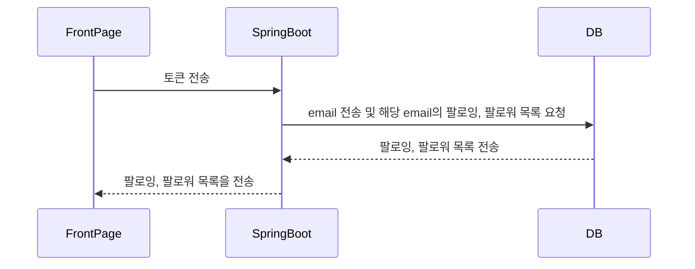

<br></br>

## 11. 프로필 편집

프로필 편집 페이지에서 닉네임, 관심태그, 비밀번호를 변경한다.

- 닉네임과 관심태그를 변경할 경우,
  1. 프로필 편집 페이지로 이동하면 DB에 저장된 프로필사진, 닉네임, 관심태그 데이터를 화면에 띄운다.
  2. 변경을 원하는 항목의 데이터를 수정한 후, 변경하기 버튼 클릭 시 프로필 데이터를 업데이트한다.

#### 닉네임, 관심태그 변경 시

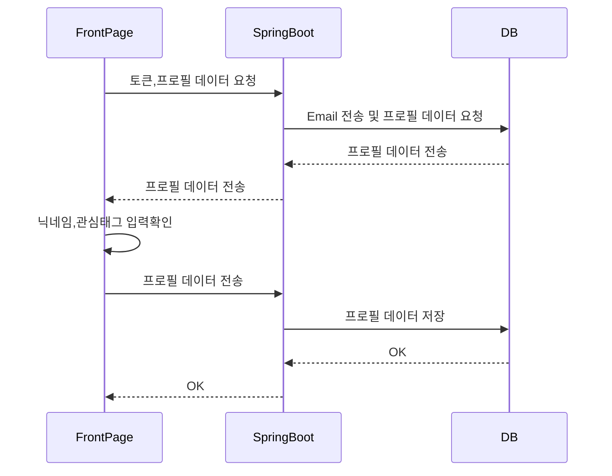

- 비밀번호를 변경할 경우,
  1. 프로필 편집 기능 중 비밀번호 변경을 선택하면 보안을 위해 먼저 현재 로그인한 계정의 비밀번호를 입력하도록 한다.
  2. 비밀번호가 일치할 경우 변경을 원하는 새 비밀번호와 새 비밀번호 확인을 입력받는다.
  3. 새 비밀번호의 유효성을 체크한 후 문제가 있다면 화면에 경고 문구를 띄운다.
  4. 새 비밀번호가 알맞게 입력되었다면 비밀번호를 업데이트한다.

#### 비밀번호 변경 시

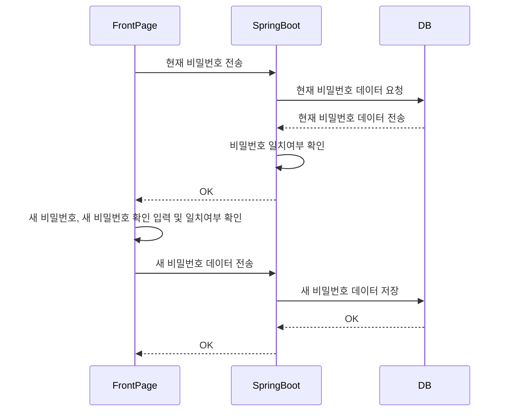

<br></br>

## 12. 검색

검색 페이지에서 다른 사용자의 계정을 검색하거나 태그명으로 검색한 태그가 달린 게시글을 검색할 수 있다.

#### 다른 사용자 검색

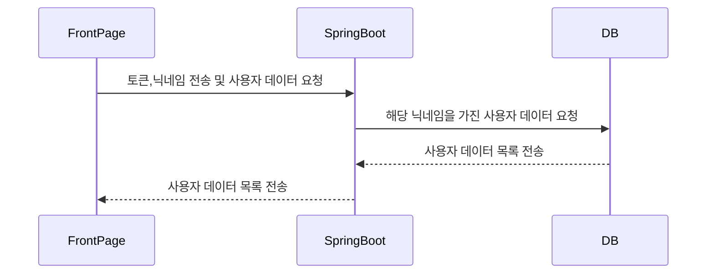

#### 태그 기반 검색

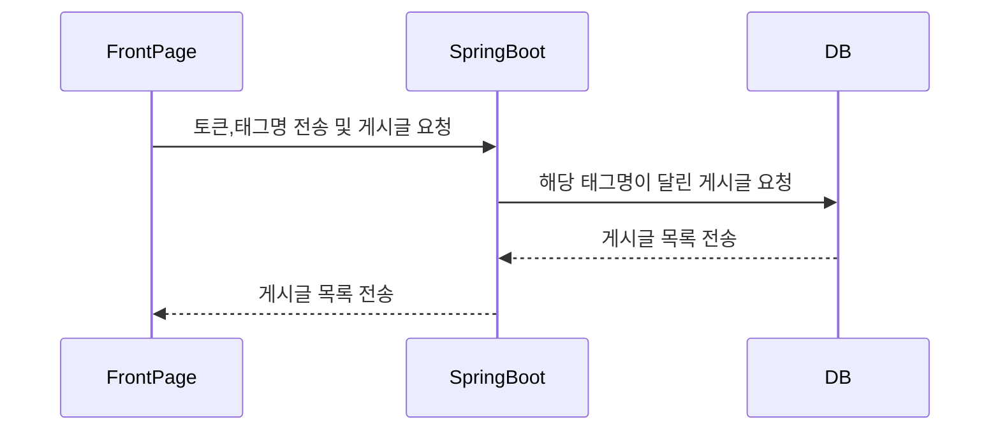

<br></br>

## 13. 알림

알림 페이지에서 자신의 게시글에 달린 댓글, 자신이 남긴 댓글에 달린 답글, 다른 사람이 나를 팔로우 했을 때 알림을 띄운다.

- 댓글/답글 알림 클릭 시 해당 게시글로 이동한다.
- 팔로우 알림 클릭 시 나를 팔로우한 사용자의 마이페이지로 이동한다.

#### 알림 목록 조회

```mermaid
sequenceDiagram
FrontPage ->> SpringBoot : 토큰 전송
SpringBoot ->> DB : 이메일 전송 및 알림목록 요청
DB -->> SpringBoot : 알림목록 전송
SpringBoot -->> FrontPage : 알림목록을 전송
```

#### 댓글/답글 알림 클릭 시 해당 게시글로 이동

 ````mermaid
sequenceDiagram
FrontPage ->> SpringBoot: 토큰,알림번호 전송
SpringBoot ->> DB : 토큰 확인 및 알림번호 전송
DB -->> SpringBoot : 알림 데이터 전송
SpringBoot ->> DB : 알림 타입에 따른 데이터 요청
DB -->> SpringBoot : 해당 댓글이 달린 게시글 번호 전송
SpringBoot -->> FrontPage : 해당 댓글이 달린 게시글 번호 전송
FrontPage ->> FrontPage : 해당 게시글의 댓글창으로 이동
 ````
